## 🎮 Alien Invasion — Pygame Project

This project is a 2D arcade-style game built in Python using Pygame, developed while following *Python Crash Course* by Eric Matthes.

# Chapter 12 — A SHIP THAT FIRES BULLETS

---

## Installing Pygame

---

## Starting the Game Project

- Creating a Pygame Window and Responding to User Input  
- Controlling the Frame Rate  
- Setting the Background Color  
- Creating a Settings Class  

---

## Adding the Ship Image

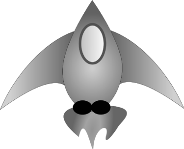

Figure 12-1: The ship for Alien Invasion

---

## Creating the Ship Class

- Creating the Ship Class  
- Drawing the Ship to the Screen  

---

## Drawing the Ship to the Screen

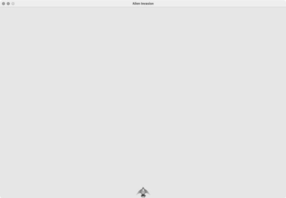

Figure 12-2: Alien Invasion with the ship at the bottom center of the screen

---

## Refactoring: The _check_events() and _update_screen() Methods

- The _check_events() Method  
- The _update_screen() Method  

---

## Piloting the Ship

- Responding to a Keypress  
- Allowing Continuous Movement  
- Moving Both Left and Right  
- Adjusting the Ship’s Speed  
- Limiting the Ship’s Range  
- Refactoring _check_events()  
- Pressing Q to Quit  
- Running the Game in Fullscreen Mode  

---

## Shooting Bullets

- Adding the Bullet Settings  
- Creating the Bullet Class  
- Storing Bullets in a Group  
- Firing Bullets  

---

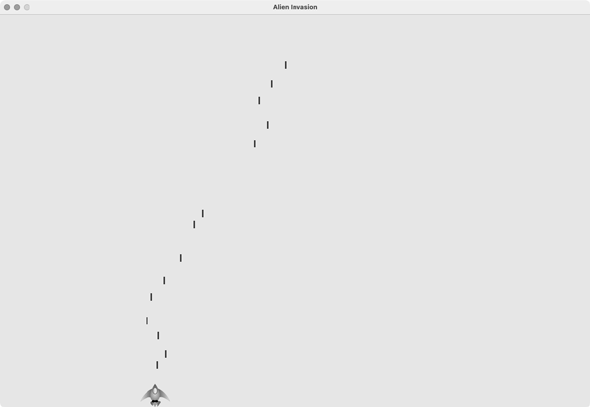

Figure 12-3: The ship after firing a series of bullets

- Deleting Old Bullets  
- Limiting the Number of Bullets  
- Creating the _update_bullets() Method  

---

# Chapter 13 — ALIENS!

---

## Creating the First Alien

Figure 13-1: The alien we’ll use to build the fleet

---

## Creating the Alien Class
- Build the Alien class to define behavior and properties.

---

## Creating an Instance of the Alien

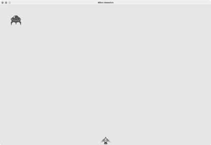

Figure 13-2: The first alien appears.

---

## Building the Alien Fleet

### Creating a Row of Aliens

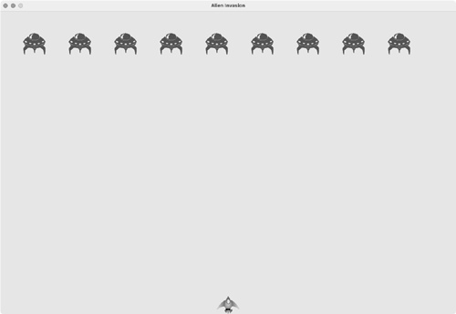

Figure 13-3: The first row of aliens

---

### Refactoring `_create_fleet()`

---

### Adding Rows

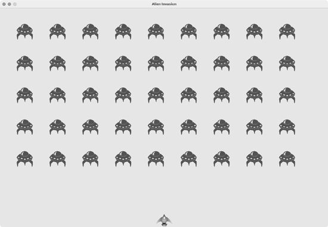

Figure 13-4: The full fleet appears.

---

## Making the Fleet Move

- Moving aliens to the right  
- Creating settings for fleet direction  
- Checking whether an alien has hit the edge  
- Dropping the fleet and changing direction  

---

## Shooting Aliens

- Detecting bullet collisions  

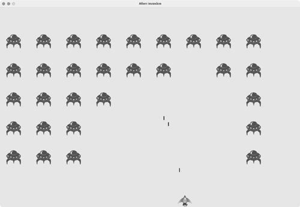

Figure 13-5: We can shoot aliens!

---

### Testing with Larger Bullets

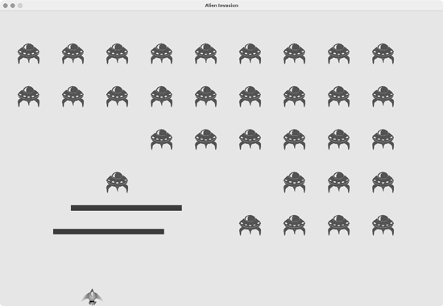

Figure 13-6: Extra-powerful bullets make testing easier

---

- Repopulating the fleet  
- Speeding up the bullets  
- Refactoring `_update_bullets()`  

---

## Ending the Game

- Detecting alien-ship collisions  
- Responding to collisions  
- Aliens reaching bottom of screen  
- Game over logic  
- Identifying when parts of the game should run  

# Chapter 14 — SCORING

---

## Adding the Play Button

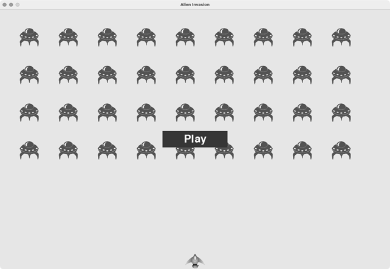

Figure 14-1: A Play button appears when the game is inactive.

- Creating a Button Class  
- Drawing the Button to the Screen  

---

## Starting the Game

- Resetting the Game  
- Deactivating the Play Button  
- Hiding the Mouse Cursor  

---

## Leveling Up

- Modifying the Speed Settings  
- Resetting the Speed  

---

## Scoring

Figure 14-2: The score appears at the top-right corner of the screen.

- Updating the Score as Aliens Are Shot Down  
- Resetting the Score  
- Making Sure to Score All Hits  
- Increasing Point Values  
- Rounding the Score  

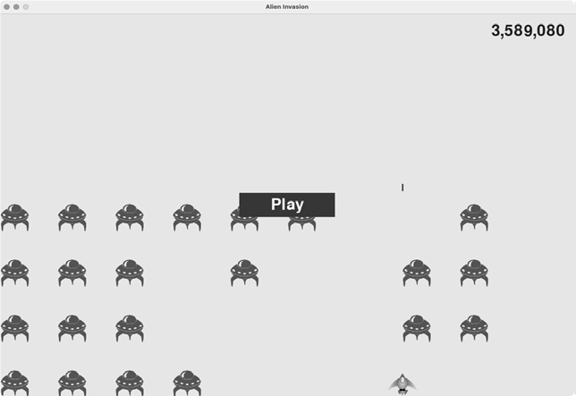

Figure 14-3: A rounded score with comma separators

---

## High Scores

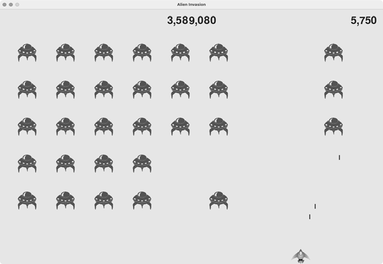

Figure 14-4: The high score is shown at the top center of the screen.

---

## Displaying the Level

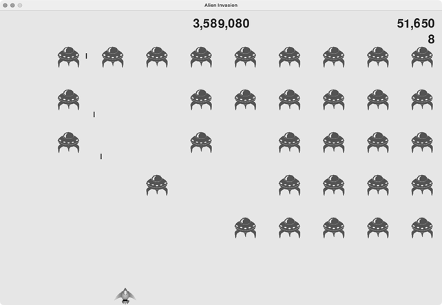

Figure 14-5: The current level appears just below the current score.

---

## Displaying the Number of Ships

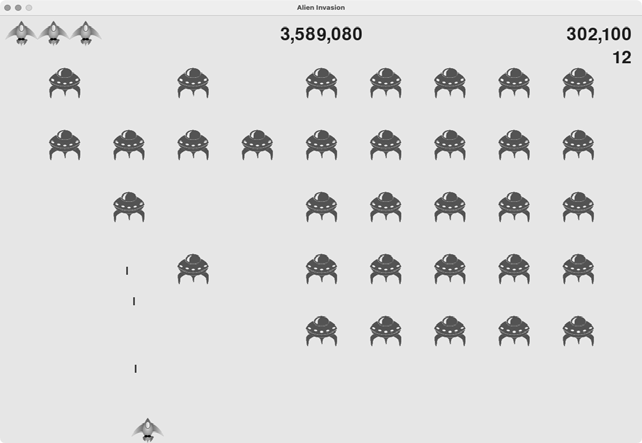

Figure 14-6: The complete scoring system for Alien Invasion
---

## 🚀 Running the Game

To run the game inside VS Code:

1. Open the project in VS Code  
2. Select (highlight) the file `alien_invasion.py`  
3. Press **Alt + X** to start the game

⚠️ Important:  
Only `alien_invasion.py` works as the entry point.  
If another `.py` file is selected, the game will not run correctly.

## 🎥 Gameplay Preview

---

## 🎮 Source Code

View the full game repository:

👉 https://github.com/jeanmarc-webdev/alien-invasion
